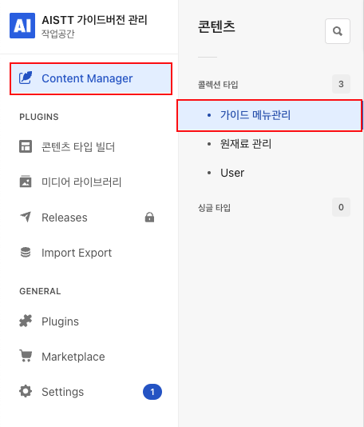
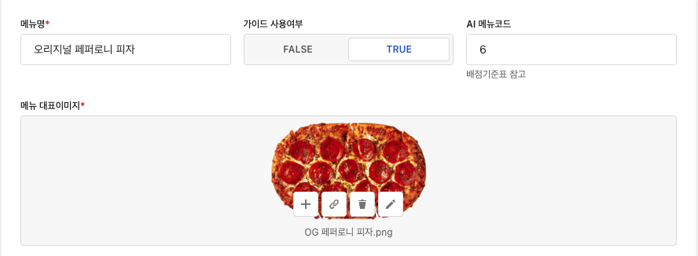
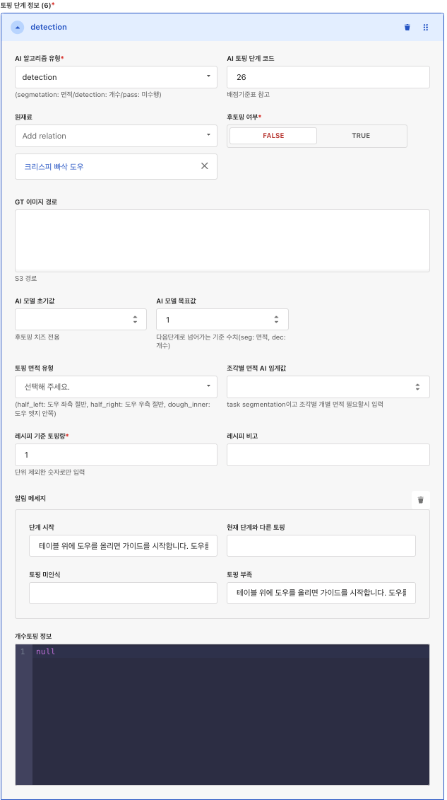

# 메뉴 등록 가이드

## 계정 정보

- 관리자 ID: ***
- 관리자 PW: ***

- [가이드 관리(스테이징)](https://stage.guide-adm.gopizza.kr/admin)
- [가이드 관리(프로덕션)](https://guide-adm.gopizza.kr/admin)
- [가이드 관리 개발 레포지토리](https://github.com/gopizza/AisttGuideAdmin)

**시작하기 전에**
Strapi 관리자 패널에서 메뉴를 등록하고 관리하는 방법을 단계별로 설명합니다.

### 1. 기본 설정

  

- "Content Manager" 접근
- 왼쪽 사이드바에서 "가이드 메뉴관리" 선택
- 새로운 메뉴 생성 시 '+새 항목 추가' 버튼 클릭
- 원재료 생성 필요시 원재료도 추가

### 2. 메뉴 기본 정보 입력

  

- 메뉴명 입력 ex. 베이컨 업데이트 피자
- 가이드 사용여부
  - TRUE: 가이드 지원 메뉴
  - FALSE: 가이드 미지원 메뉴
- AI 메뉴코드: 배점 기준표 기준 제품ID
- 메뉴 이미지 업로드
- 이미지 보정 거친 메뉴이미지 업로드

### 3. 단계별 토핑 정보 입력

  

- AI 알고리즘 유형 선택

  - Detection: 개수 기반 토핑 검출
  - Segmentation: 면적 기반 토핑 검출
  - Pass: 가이드 미진행 단계 설정
  - Skip_drizzle: 드리즐 전용 비전 인식 스킵 (30초 후 넘어감)
  - Skip_powder: 파우더 전용 비전 인식 스킵 (30초 후 넘어감)

- 단계별 상세 설정

  1.  토핑 단계 코드 입력: 배점기준표 기준
  2.  원재료 정보 입력
  3.  후토핑 여부 선택
      - True 선택 시 해당 단계 자동 스킵
  4.  GT 이미지 경로 입력
      - S3에 업로드된 공용 GT이미지 경로 입력
  5.  AI 모델 초기값 입력
      - Default: 0
      - Segmentation: 면적값 입력
      - Detection: 개수값 입력
      - 주의: 치즈 후토핑 등 기존 토핑 보정 수치 고려
  6.  AI 모델 목표값 입력
      - 토핑 완료 시점의 모델 추론값
  7.  토핑 면적 유형 선택
      - Dough_inner: 엣지 안쪽
      - half_left: 도우 절반 좌측
      - half_right: 도우 절반 우측
  8.  조각별 면적 입력
      - 기본값: AI 모델 목표값
      - 토핑면적 유형 변경 시 수치 조정 필요
  9.  알림 메시지 설정
      - "단계 시작" 메시지
      - "토핑 부족" 메시지
  10. 개수 토핑 정보 입력
      - Detection 토핑 단계 GT 이미지 등록
      - https://stage.aistt-guide.gopizza.kr/editor 에서 포지션 설정
      - 생성된 JSON 데이터 복사 후 입력

<video src="./video/개수토핑_포지션등록.mp4" width="720" controls></video>

**4. 최종 확인 및 저장**

- 모든 설정 확인
- 저장 버튼 클릭
- 최초 생성 시 "발행" 버튼눌러야 노출됩니다.

**주의사항**

- 메뉴 설정 후 반드시 저장 필요
- Import/Export 기능으로 설정 백업 가능
- 하위 메뉴 구조는 신중하게 설계 필요

**관리 팁**

- 수정이 필요한 경우 언제든 수정 가능
- 메뉴 구조 변경 시 전체 서비스 영향도 고려
