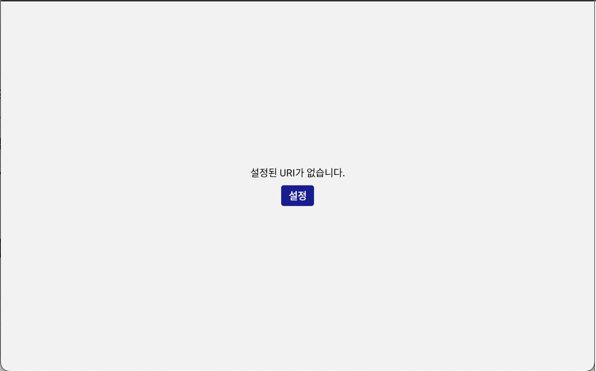
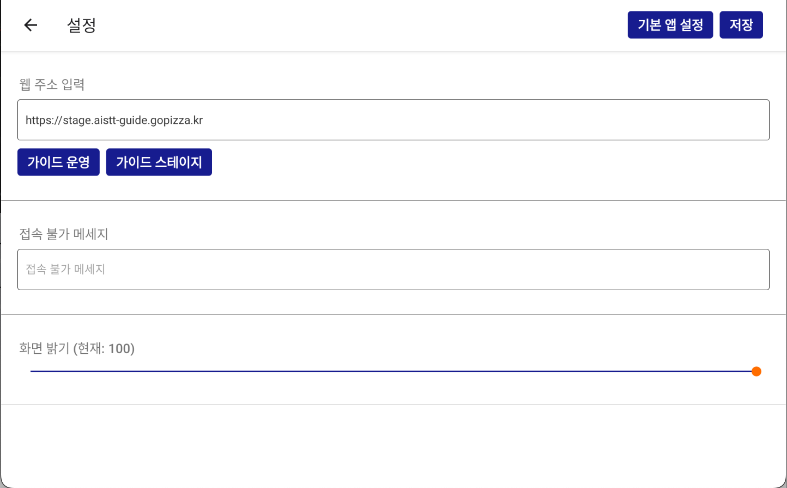
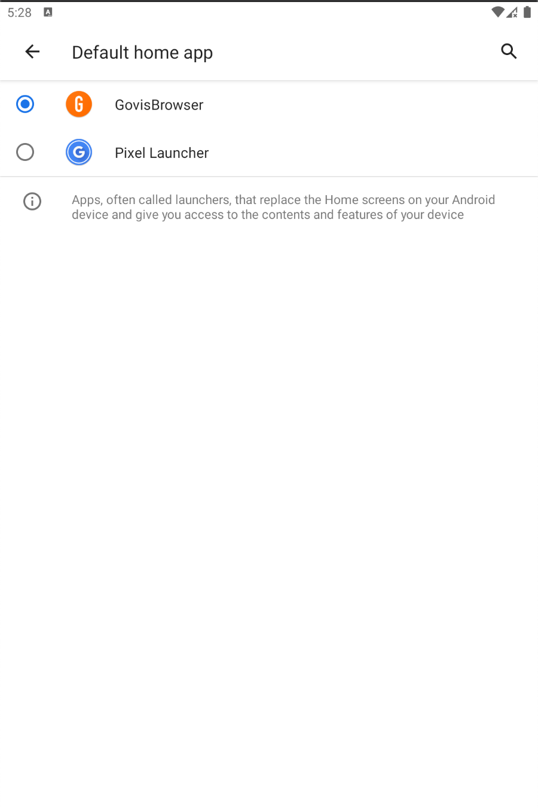

# 태블릿 세팅 가이드

## 목차

1. [시스템 요구사항](#시스템-요구사항)
2. [설치 전 준비사항](#설치-전-준비사항)
3. [설치 과정](#설치-과정)
4. [초기 설정](#초기-설정)

## 개요

GovisBrowser Webview와 같이 사용해야하는 이유

1. Browser의

## 시스템 요구사항

### 하드웨어 요구사항

- 저장공간: 최소 2GB 이상의 여유공간
- RAM: 최소 4GB 이상
- 프로세서: 듀얼코어 1.5GHz 이상
- 화면해상도: 1280 x 800 이상

### 소프트웨어 요구사항

- 운영체제: Android 8.0 이상
- 인터넷 연결 필수

## 설치 전 준비사항

1. 기기 상태 확인
   - 배터리 잔량 50% 이상 확보
   - 안정적인 Wi-Fi 연결 확인
   - 충분한 저장공간 확보

## 설치 과정

### 1단계: 태블릿 APK 다운로드

1. 태블릿에서 해당 ["다운로드 경로"](https://github.com/gopizza/GovisBrowser/releases/tag/v0.2)에 있는 APK 다운로드 후 설치

### 2단계: 프로그램 설치

1. 파일 관리자에서 다운로드 폴더안에 APK 파일 설치

## 초기 설정

### 1단계: 가이드버전 주소 설정

1. "설정" 버튼 클릭

2. "기본 앱 설정" 및 웹 주소 설정
   - "가이드 운영" 버튼 클릭 시 가이드버전 프론트 운영주소로 입력됨
   - "가이드 스테이지" 버튼 클릭 시 가이드버전 프론트 스테이징 환경 주소로 입력됨

3. "기본 앱 설정" 기본 앱 설정 시 홈버튼 클릭시 배경화면이 아닌 설정한 앱으로 전환됨.

### 기본 환경설정

- Webview URL 설정
- 화면 밝기 조정
